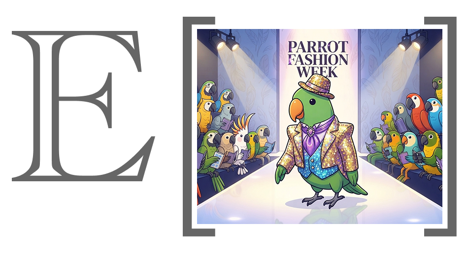

# Runway



Static HTML previews of EDSL human-survey questions.

Runway turns a saved EDSL survey into a self-contained HTML page that looks like
the live web survey a respondent would see — same markup, same stylesheet, same
font. No browser, no node, no server: a file in, a file out.

**Scope today: the choice family — `multiple_choice`, `likert_five`, `yes_no`
and `linear_scale` — plus `matrix`, `checkbox`, `checkbox_with_other`,
`free_text` and `survey_message`.** Every other type renders a "No preview is
available" notice.
Types are added one at a time because each is held to byte-for-byte agreement
with the live survey's own components — see [SPEC.md](SPEC.md).

## Copy and paste into a coding agent

````text
# runway — static HTML previews of EDSL human surveys

Turns an EDSL survey into a self-contained HTML page that looks like the live
web survey a respondent would see. No browser, no node, no server.

## Install

Not on PyPI (it pins edsl to a git branch, which PyPI rejects), so install from
git. Needs Python >=3.10, git, and network access.

```bash
uv tool install git+https://github.com/expectedparrot/runway.git   # CLI
uv add git+https://github.com/expectedparrot/runway.git            # as a dep
pip install git+https://github.com/expectedparrot/runway.git
```

## Input

A survey saved by edsl. `.ep`, `.json.gz` and `.json` all work and all give the
same preview. The humanize schema, if there is one, is separate — a survey
carries none.

```python
import json
from pathlib import Path

survey.save("survey")                                    # -> survey.ep
Path("schema.json").write_text(json.dumps(humanize_schema, indent=2))
```

Do not hand-write a survey file. A bare list of question dicts, or a document
that stubs `memory_plan` or `rule_collection`, is refused.

## Commands

A verb is always required.

```bash
runway check  survey.ep --schema schema.json   # what each question will render as
runway render survey.ep --schema schema.json   # write the HTML
runway types                                   # which types have a control
runway guide                                   # what it does and cannot do
runway version
```

`render` writes `./previews/<survey>.html` — one file, all questions, with a
toolbar to move between them. `-o DIR` to change it, `--split` for one file per
question (much larger; the stylesheet is re-inlined each time). Several surveys
may be given at once, so long as their names differ.

`check` writes nothing and is the fast way to see what you'll get:

```
mixed_survey.json  -  7 items

  drawn      commute_mode          multiple_choice
  drawn      commute_time          multiple_choice
  drawn      commute_enjoyment     likert_five
  drawn      commute_satisfaction  linear_scale
  drawn      commute_switch        yes_no
  note       commute_barriers      rank    (no preview built for this type yet)
  warning    commute_breakdown     dict    (never shown to a respondent)

5 drawn, 1 note, 1 warning
```

Four outcomes, and they mean different things:

- `drawn` — the real control; the preview is accurate.
- `automatic` — `compute`, `image_generation`, or any type wrapped by
  `thinking_question()`. Nobody is ever asked it; nothing is missing.
- `note` — a type a human survey supports but runway hasn't transcribed yet.
  The survey is fine; the tool is behind.
- `warning` — no human-survey rendering exists anywhere. Fix the survey.

`check` exits 1 on `warning`, and on a file it cannot read. `--json` on
`check`, `types` and `version`.

## Drawn today (9)

`multiple_choice`, `yes_no`, `likert_five`, `linear_scale`, `matrix`,
`checkbox`, `checkbox_with_other`, `free_text`, `survey_message`. Everything
else renders a complete page with a note where the control would be — so wording
and position are still checkable.

## Caveats

- Piped values are not resolved. `{{ agent.x }}`, `{{ scenario.x }}` render as
  written.
- A matrix carousel (`format: {type: carousel}`) is drawn, but you cannot swipe
  it — use the arrows, and try it on a phone before sending the survey out.
- Position is inferred from authored order, so skip logic will differ.
- Controls tick but mostly don't behave. Checkbox Select-all and exclusive
  options do work; validation, limits and Next do not.
- Media is not resolved — an option referencing a file previews as its
  reference text.
````

## Install

**Not on PyPI** — it pins `edsl` to a git branch, which PyPI rejects — so
install from git. Needs Python 3.10+, git, and network access.

```bash
uv tool install git+https://github.com/expectedparrot/runway.git   # the CLI
uv add git+https://github.com/expectedparrot/runway.git            # as a dependency
pip install git+https://github.com/expectedparrot/runway.git
```

Or from a checkout, which is also how to work on it:

```bash
git clone https://github.com/expectedparrot/runway.git
cd runway
uv sync                 # --extra dev adds pytest and ruff
uv run runway check examples/mixed_survey.json
```

Three runtime dependencies: **Jinja2**, **`markdown-it-py[linkify]`** and
**`edsl`**.

## Usage

```bash
runway check  survey.ep       # what each question will render as
runway render survey.ep       # write the HTML
runway types                  # which question types have a control
runway guide                  # what this does, and what a preview cannot show
runway version                # version, and the types it draws
```

The survey file is `.ep`, `.json.gz` or `.json` — see
[Input format](#input-format). A verb is always required: `runway survey.ep` is
not a shortcut for `runway render survey.ep`, so what a command does never
depends on what its argument happens to be named. `python -m runway` is the same
entry point if you would rather not rely on the script being on `PATH`.

### check

Start here. It writes nothing, and tells you what each question will become:

```
$ runway check examples/mixed_survey.json

mixed_survey.json  -  7 items

  drawn      commute_mode          multiple_choice
  drawn      commute_enjoyment     likert_five
  drawn      commute_satisfaction  linear_scale
  note       commute_barriers      rank             (no preview built for this type yet)
  warning    commute_breakdown     dict             (never shown to a respondent)

5 drawn, 1 note, 1 warning
```

Four verdicts, and they are genuinely different news:

| verdict | meaning |
| --- | --- |
| **drawn** | previews with its real control |
| **automatic** | answered on the server, so nobody is ever shown it and nothing is missing |
| **note** | no control transcribed for the type yet — the survey is fine, the preview is behind |
| **warning** | the type has no human-survey rendering anywhere, so no preview could exist |

Only **warning** exits non-zero, and it is the only one that is about the survey
rather than about this package.

`check` is also where the thinking wrapper shows up — a `multiple_choice` that
would otherwise look perfectly previewable, and that nobody is ever asked. It is
the case worth having a command for at all:

```
  automatic  pet_category    multiple_choice   (thinking)
```

### render

```bash
runway render examples/mixed_survey.json            # -> previews/mixed_survey.html
runway render survey.ep                             # -> previews/survey.html
runway render examples/mixed_survey.json --split    # -> one file per question
runway render examples/*.json                       # -> one .html per survey
runway render examples/*.json -o build/review       # -> somewhere else
```

Each survey is written under its own name — the file's, with the format suffix
taken off — so several can share one output directory. Two whose names agree,
like `survey.ep` and `survey.json`, are refused rather than one silently
replacing the other.

By default the whole survey lands in **one HTML file**, with a toolbar
across the top to jump between questions (arrows, a dropdown, arrow keys).
`--split` writes one file per question instead, which is far larger for anything
but a short survey because each file re-inlines the stylesheet. `--json` on
`check`, `types` and `version` gives machine-readable output.

Questions with no control here still get a full page — same shell, same progress
indicator, and **their question text rendered in the usual markup** — with a note
or a warning standing in for the input, so a mixed survey previews end to end and
wording can still be checked. The exception is questions whose text a respondent
never sees, where it is suppressed rather than implying the survey shows it.

Runway is importable too: `load`, `load_schema`, `render_bundle`, `render_page`
and `render_survey` are the public surface — see
[SPEC.md](SPEC.md#python-api).

## Question types

These are the types a human survey can be configured for, and where each one
stands here. A type still awaiting a preview gets a note in place of its
control; the rest of its page is complete, so its wording and position in the
survey can be checked meanwhile.


| question type         | preview         |     | question type                | preview         |
| --------------------- | --------------- | --- | ---------------------------- | --------------- |
| `budget`              | — not yet       |     | `list`                       | — not yet       |
| `checkbox`            | **✅ available** |     | `matrix`                     | **✅ available** |
| `checkbox_with_other` | **✅ available** |     | `multiple_choice`            | **✅ available** |
| `compute`             | **✅ automatic** |     | `multiple_choice_with_other` | — not yet       |
| `file_upload`         | — not yet       |     | `numerical`                  | — not yet       |
| `free_text`           | **✅ available** |     | `rank`                       | — not yet       |
| `image_generation`    | **✅ automatic** |     | `survey_message`             | **✅ available** |
| `interview`           | — not yet       |     | `top_k`                      | — not yet       |
| `likert_five`         | **✅ available** |     | `yes_no`                     | **✅ available** |
| `linear_scale`        | **✅ available** |     |                              |                 |


Three results are worth expecting: `checkbox` draws a **Select all** row nothing
in the question asked for, `checkbox_with_other` never draws it, and a `matrix`
configured as a carousel draws neither the grid nor the stacked list — the
carousel replaces the pair rather than joining them.
[SPEC.md](SPEC.md#what-a-preview-reproduces) has why.

A type **outside** this table — `dict`, for instance — cannot be shown to a
respondent at all, so its page carries a warning rather than a note: what needs
changing is the survey.

`compute`, `image_generation` and anything wrapped by `thinking_question()` are
marked *automatic* — the survey answers them itself and no respondent ever sees
them. `examples/background_survey.json` has all three.

`survey_message` is the one type drawn with **no control at all**, and that is
the whole page rather than a gap in it: a message is text a respondent reads and
then continues past with Next. Nothing is missing from that page, so it carries
no note.

## Input format

Save the survey, then point runway at it. `.ep`, `.json.gz` and `.json` all
work, and all give the same preview:

```python
survey.save("survey")            # -> survey.ep
survey.save("survey.json")       # -> survey.json
```

A humanize schema is saved separately, so pass it separately:

```python
Path("schema.json").write_text(json.dumps(humanize_schema, indent=2))
```

```bash
runway render survey.ep --schema schema.json
```

The schema file is the same object you would pass to `Survey.humanize()`, so one
written for a real deployment works here unchanged:

```json
{
  "questions": { "question_name": { "format": {"type": "dropdown"} } },
  "survey":    { "custom_css": ".edsl-question-text { font-size: 1.4rem }" }
}
```

Writing the schema into the survey file instead does nothing — pass it with
`--schema`. Anything that is not a saved survey is refused with a message saying
what to do about it. [SPEC.md](SPEC.md#loading-a-survey) has the reasoning behind
both.

## Known gaps

What a preview cannot show you. [SPEC.md](SPEC.md) explains why in each case.

- **Fonts.** Plus Jakarta Sans is linked from Google Fonts, matching the live
  survey — the one external request a page makes, so it renders with fallback
  metrics offline.
- **Rich question text and option labels.** Images, video and PDFs referenced
  from question or option text are resolved server-side during a live run; here
  such an option previews as the reference text it was written as.
- **Dragging a matrix carousel.** The layout is drawn and the arrows work, and
  answering a row advances to the next one as the live page does. What is
  missing is the gesture: the live survey follows a finger through a swipe and
  decides where to land from how fast it moved, and a preview does neither, so
  a swipe does nothing at all. On a touch screen that is the difference between
  reading the layout and using it — preview the format here, then try a real
  one on a phone before the survey goes out.
- **Option randomization.** Not applied; the authored order is shown.
- **Piped values.** `{{ agent.x }}`, `{{ scenario.x }}` and `{{ q_name.answer }}`
  render as written. Resolving them means binding a survey to agent and scenario
  data, which would be a per-binding rendering.
- **Position is inferred** from the authored item list, where the live page
  resolves it from survey flow — so a survey with skip logic will differ, the
  further a respondent skips the more so. The renderings themselves are exact.
- **Settings that govern submission, not markup.** `optional`,
  `custom_validation`, `submitting_indicator` and attention checks are accepted
  and ignored — none is visible on a static page. `comment` and `progress` *are*
  rendered.
- **The Next button does nothing.** The `<form>` is rendered for layout parity
  but has no `action`. Use the toolbar to move between questions.
- **A clicked option only half responds.** Clicking a radio fills it in, but the
  box around it does not light up the way the live page's does. The stacked
  matrix view is the exception.
- **Only two checkbox rules work.** **Select all** and `exclusive_options` do;
  selection limits and validation do not.
- **A Coop-linked `.ep` can change when you open it.** Previewing one may fetch a
  newer version from Coop and rewrite the file, which is edsl's behaviour for
  any `load()`.

## Documentation

[SPEC.md](SPEC.md) is how a preview is built and why its output can be trusted:
the design constraints the markup is held to, the recorded goldens that hold it
there, how a survey is loaded, the two markdown surfaces, the toolbar and
progress indicator, the behaviour a preview reproduces, how to add a question
type, how to regenerate the stylesheet, and the file layout.

[AGENTS.md](AGENTS.md) is the operating contract for changing this repository.

## License

MIT — see [LICENSE](LICENSE). Third-party notices for vendored icon geometry,
reproduced attribute names and generated CSS are in [LICENSES.md](LICENSES.md).
